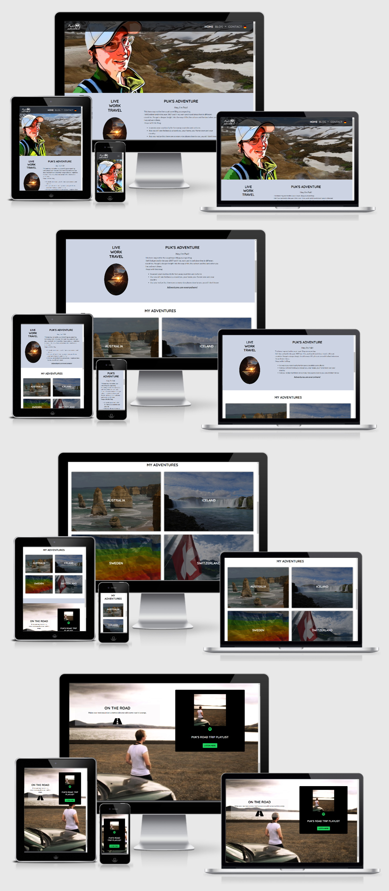

Milestone Project 1
======
## Puk's Adventure Travel Blog

By: [Marina Christen](mailto:puksbusinessworld@gmail.com), February 2021<br>
This webpage is the first of four Milestone Projects which is a part of the Full Stack Web Development Program of the [Code Institute](https://www.codeinstitute.net/).


Screenshot
======

All screenshots created using [Am I responsive](http://ami.responsivedesign.is/).



[View the screenshots of the Blog page Australia here.](assets/images/screenshots/blog-australia.jpg)<br>
[View the screenshots of the Blog page Iceland here.](assets/images/screenshots/blog-iceland.jpg)<br>
[View the screenshots of the Blog page Sweden here.](assets/images/screenshots/blog-sweden.jpg)<br>
[View the screenshots of the Blog page Switzerland here.](assets/images/screenshots/blog-switzerland.jpg)<br>
[View the screenshots of the Contact page here.](assets/images/screenshots/contact.jpg)<br>
[View the screenshots of the 404 Error page here.](assets/images/screenshots/404-error.jpg)

Live Project
======
[View the live project here](https://puksrevolution.github.io/milestone-project-1/index.html)

# Table of contents

+ [Project Overview](#project-overview)
  * [Project requirements](#project-requirements)
  * [Website description](#website-description)

+ [User Experience](#user-experience)
  * [User Stories](#user-stories)
    + [First Time Visitor Goals](#first-time-visitor-goals)
    + [Returning and Frequent User Goals](#returning-and-frequent-user-goals)
    
+ [Design](#design)
  * [Colour Scheme](#colour-scheme)
  * [Typography](#typography)    
  * [Imagery](#imagery)
  * [Icons](#icons)
  * [Wireframes](#wireframes)

+ [Features](#features)
  * [Current Features](#current-features)
  * [Future Features](#future-features)

+ [Technologies used](#technologies-used)
  * [Languages Used](#languages-used)
  * [Frameworks Libraries and Programs](#frameworks-libraries-and-programs)

+ [Testing](#testing)    
  * [Testing User Stories from User Experience](#testing-user-stories-from-user-experience)
  * [Testing Tools](#testing-tools)
  * [Further Testing](#further-testing)
  * [Known Bugs](#known-bugs)      

+ [Deployment](#deployment)
  * [Resporitory on GitHub](#resporitory-on-github)
  * [Workspace on GitPot](#workspace-on-gitpot)
  * [Back to GitHub](#back-to-github)
  * [Deploy the projet to GitHub Pages](#deploy-the-projet-to-github-pages)

+ [Credits](#credits)
  * [Code](#code)
  * [Media](#media)
  * [Content](#content)
  * [Acknowledgements](#acknowledgements)

<small><i><a href='http://ecotrust-canada.github.io/markdown-toc/'>Table of contents generated with markdown-toc</a></i></small>

Project Overview
======

### Project requirements
It is required to build a static front end website of at least 3 pages or, 
if using a single scrolling page, at least 3 separate page areas with using HTML, CSS, 
and optional Bootstrap or other libraries.
The information has to be presented in a useful ordered way to a set of users.

### Website description
This website is build for a fictional person, who starts a simple travel Blog with low content, 
but with a two language option (English, German).
The purpose of this Blog is to give the Blogger a platform to present all the stories and experiences, 
how it is to live and work in another country, how it is to travel and exploring it, to introduce users to places, 
activities and adventures they didn't even know existed, 
to awake with this stories the user's curiosity and expand their horizon. Adventures are everywhere possible.

User Experience
======

### User stories
**First Time Visitor Goals**
- As a First Time Visitor, I want to be able to easily navigate throughout the site.
- As a First Time Visitor, I want to easily understand the main purpose of this site.
- As a First Time Visitor, I want to be able to easily find on the site interesting stories and information.
- As a First Time Visitor, I would like to be able to see images of places and activities.
- As a First Time Visitor, I want to locate the Bloggers social media links to see all the other activities of the Blogger.

**Returning and Frequent User Goals**
- As a Returning and Frequent User, I would like to be able to get in contact with the blogger for questions about the Blog and the Blogger.
- As a Returning and Frequent User, I want to check to see if there are any new Blog posts. 
- As a Returning and Frequent User, I want to sign up to a Newsletter so that I am emailed any major updates and/or changes to the website.

Design
======

### Colour Scheme
The colour for the Body is #ccd3e2.<br>
The Header and Footer have a transparent background colour of rgba(0, 0, 0, 0.7).<br>
The colours for the Font and Icons are #000 and #fff.<br>
The colour for the Spotify Icon and button is #1ED760 and when you hover over rgb(4, 114, 42).<br>
The colours for the buttons is generally rgb(163, 166, 172) and when you hover over it is #000.

### Typography
The Fonts are from [Google Fonts](https://fonts.google.com/).<br>
The Sans Serif Font will be displayed by default through the whole website.<br>
The Lato Font is used for the Body. The Lato Font gives a feeling of warmth, while the strong structure provides stability and seriousness.<br>
The Quicksand Font is used for all headings. Quicksand is designed for display purposes.

### Imagery
The large background hero image is designed to present a bit of the personality of the Blogger and catch the user's attention with a view of the Bloggers number one place.
All added photos are provided by the fictional Blogger (personal pictures of the Developer), are added to all Blog posts on the site and where also used as background images for sections.
The Developer used a photography to create the 404 Error image.

### Icons
All used Icons are from [Font Awesome](https://fontawesome.com/) to highlight some parts of the webpage and for a nice look for the Social Media Links.<br>
The flag Icons are made by the Developer.

### Wireframes
[View the wireframes here.](assets/images/wireframe/wireframe-milestone-project-1.jpg)

Features
======

### Current Features
- Responsive on all device sizes through using Bootstrap (mobile first design)
- Inlineblock Navbar with dropdown menu ≥576px and collapse Navbar <576px
- Hover over elements
- Collapse elements
- Form with submit button, unfortunately not submitting, because I don't have the knowledge yet to make it work, but I will change that after I learn how to do so in the next few lessons of the course.
- Social Media Icons and Links to Social Media in the Footer.

### Future Features
<dd> *if the Blogger wants to get into the business to get professional with the site and provides more content.* </dd>

- A separate page for each Blog post.
- A sections for videos on the Blog post pages.
- A search field and a search button to make the users search fast and easy.
- A pagination at the bottom of the Blog posts sites to navigate between the pages, in case of a large number of Blog posts.
- A comment section at the bottom of the Blog posts and a feature to share the post with others.
- A map with all destinations marked and with added pictures to this places and route planes.
- A Sing Up section at the bottom of the landing and contact page for a planed Newsletter.
- An extra site for a Podcast.
- Sections for any sponsors and partners.

Technologies Used
======

### Languages Used
- [HTML5](https://developer.mozilla.org/en-US/docs/Web/Guide/HTML/HTML5)
- [CSS3](https://developer.mozilla.org/en-US/docs/Web/CSS)
- [Bootstrap](https://getbootstrap.com/docs/4.3/getting-started/introduction/#js)

### Frameworks, Libraries & Programs Used
- [Bootstrap 4.4.1:](https://getbootstrap.com/docs/5.0/getting-started/introduction/#css)<br>
Bootstrap was used to assist with the responsiveness and styling of the website.

- [Hover.css:](https://ianlunn.github.io/Hover/)<br>
Hover.css was used on the Social Media Icons in the Footer and the flag Icon in the Navbar to add a growing effect while being hovered over.
- [Google Fonts:](https://www.googlefonts.com)<br>
Google fonts were used to import the Lato and Quicksand Font into the style.css file which is used on all pages throughout the project.
- [Font Awesome:](https://www.fontawesome.com)<br>
Font Awesome was used on all pages throughout the website to add Icons for aesthetic and UX purposes.
- [jQuery:](https://getbootstrap.com/docs/4.3/getting-started/introduction/#js)<br>
jQuery came with Bootstrap to make the navbar responsive.
- [Git](https://git-scm.com/)<br>
Git was used for version control by utilizing the Gitpod terminal to commit to Git and push to GitHub.
- [GitHub:](https://github.com/)<br>
GitHub is used to store the projects code after being pushed from Git.
- [paint.net:](https://www.getpaint.net/download.html)<br>
paintnet was used to create the logo, Hero image, resizing images and editing photos for the website.
- [paint.net:](https://www.getpaint.net/download.html)<br>
paint. net was used to create the [wireframes](wireframe/wireframe-milestone-project-1.jpg) during the design process.

Testing
======

### Testing User Stories from User Experience
- First Time Visitor Goals
    * As a First Time Visitor, I want to be able to easily navigate throughout the site.
        + At the top of every site is a logo with a link to the index page and a clean and 
        easily readable navigation bar with good describes link of the pages of the website.

    * As a First Time Visitor, I want to easily understand the main purpose of this site.
        + Underneath the navigation is a Hero Image, to see on it is the Blogger and 
        in the background one of the favourite places of the Blogger, 
        directly followed by an informative About section.

    * As a First Time Visitor, I want to be able to easily find on the site interesting stories and information.
        + The new visitor will notice after the About section a simple nice Overview section, 
        four images with a linked title to the attendant Blog pages, 
        about all the countries of which currently a Blog site with posts is available.      

    * As a First Time Visitor, I would like to be able to see images of places and activities.
        + On all pages, besides the Contact site, are nicely placed images of the places and 
        the activities from these countries.

    * As a First Time Visitor, I want to locate the Bloggers social media links to see all the other activities of the Blogger.
        + At the bottom of every page is a footer section with social icons, 
        which are linked to the social media pages and email address of the Blogger. 
        So the users have the possibility to get in touch with the Blogger.   

- Returning and Frequent User Goals

    * As a Returning and Frequent User, I would like to be able to get in contact with the blogger for questions about the Blog and the Blogger.
        + The user can get with the contact form on the contact page in touch with the Blogger 
        or over the social icons in the footer section, 
        which are at all pages at the bottom.

    * As a Returning and Frequent User, I want to check to see if there are any new Blog posts.  
        + There is at the moment no feature, which shows new Blog posts, 
        which will be a future feature.

    * As a Returning and Frequent User, I want to sign up to a Newsletter so that I am emailed any major updates and/or changes to the website.
        + This is also not a requested feature of the Blogger, 
        but it would be a good feature for the future, 
        if the Blogger plans to make regular Blog posts.

### Testing Tools
- [W3C Markup Validator](https://validator.w3.org/nu/?doc=https%3A%2F%2Fpuksrevolution.github.io%2Fmilestone-project-1%2F)
- [W3C CSS Validator](https://jigsaw.w3.org/css-validator/validator?uri=https%3A%2F%2Fpuksrevolution.github.io%2Fmilestone-project-1%2F&profile=css3svg&usermedium=all&warning=1&vextwarning=&lang=de)
- [Google Chrome Developer Tools](https://developers.google.com/web/tools/chrome-devtools)
- [Google Chrome Lighthouse](https://developers.google.com/web/tools/lighthouse)

### Further Testing
I used Developer Tools to test the website through different browsers and screen sizes.<br>
I used Google Chrome Lighthouse, W3C Markup Validator and W3C CSS Validator to run tests.<br>
I optimized the SEO with a meta description, I secured links with rel="noopener" and 
I changed the html lang="en" on all German pages to html lang="de". <br>
I tested all links numerous times for their correctly functionality.<br>
Friends tested the site on their devices, review the content of the website and the documentation 
to point out any bugs, issues or mistakes.<br>
I also did some recommended style changes of my Mentor for the website.

### Known Bugs
- I noticed that the hero images took too much space of the height of the screen on all devices, so I changed that.
- I also changed the footer height and the sizes of the social media icons, so that they fit on all size screens in one line and the text has also get better presented.
- I noticed some spelling mistakes which I have fixed.

Deployment
======

### Resporitory on GitHub
- I log into my GitHub account and get to "Your repositories"
- I used the my-full-temlate Repository I got from the [Code Institute](https://www.codeinstitute.net/) to created a public milestone-project-1 Repository with the button "use this Template".

### Workspace on Gitpod
- I used the green "Gitpod" button to open the milestone-project-1 Repository in the workspace Gitpod.
- I pinned first the workspace milestone-project-1 on the dashbord.
- Then I opened the workspace and created the required folders, files and code for the website and added all needed images.
- I used regular the git commands to commit and save the work on Gitpod.

### Back to GitHub
- I saved the work I did on Gitpod at the end of every day with the help of the git push command, which pushes (saves) everything back on GitHub.

### Deploy the projet to GitHub Pages
- I located at the top of the Repository the "Settings" Button on the menu.
- I had to scroll down the Settings page untilthe "GitHub Pages" Section.
- I clicked the dropdonwn called "None" under "Source" and select "Master Branch".
- I clicked on the "Save" button and the page automatically refreshed.
- I had to scroll down again to the "GitHub Pages" Section to get the published site link for my project.

Credits(Credits)
======

### Code
Used code from [Bootstrap](https://getbootstrap.com/)
- Template code for the [navbar-brand images](https://getbootstrap.com/docs/4.3/components/navbar/#brand) and the [responsive navbar](https://getbootstrap.com/docs/5.0/components/navbar/#nav) that automatically collapses with a dropdown menu.
- Template code for [Image overlays](https://getbootstrap.com/docs/4.3/components/card/#image-overlays).
- Template code for the [Cards](https://getbootstrap.com/docs/4.3/components/card/#example).
- Template code for the [Card decks](https://getbootstrap.com/docs/4.3/components/card/#card-decks).
- Template code for the [Image thumbnails](https://getbootstrap.com/docs/4.3/content/images/#image-thumbnails).
- Template code for the [Jumbotron component](https://getbootstrap.com/docs/4.3/components/jumbotron/).

Used code from [Chris Coyier](https://css-tricks.com/perfect-full-page-background-image/)

- Template code for the [Perfect Full Page Background Image](https://css-tricks.com/perfect-full-page-background-image/)

```
html {
	background: url(images/bg.jpg) no-repeat center center fixed; 
	-webkit-background-size: cover;
	-moz-background-size: cover;
	-o-background-size: cover;
	background-size: cover;
}
```
Used code from [GitHub](https://ianlunn.github.io/Hover/):<br>
- class name from [Hover.css](https://ianlunn.github.io/Hover/)<br>
- Copied link for stylesheet for the Head section from [cdnjs.com](https://cdnjs.cloudflare.com/ajax/libs/hover.css/2.3.1/css/hover-min.css)

```
.hvr-grow {
    display: inline-block;
    vertical-align: middle;
    -webkit-transform: perspective(1px) translateZ(0);
    transform: perspective(1px) translateZ(0);
    box-shadow: 0 0 1px transparent;
    -webkit-transition-duration: .3s;
    transition-duration: .3s;
    -webkit-transition-property: transform;
    transition-property: transform;
}
```
Used code from [w3schools.com](https://www.w3schools.com/)

- Template code for hover over a inline element to show a <div> element

```
div {
  display: none;
}

span:hover + div {
  display: block;
}
```

- Template code for [Responsive Polaroid Images / Cards](https://www.w3schools.com/css/tryit.asp?filename=trycss_ex_images_card)

```
div.polaroid {
  width: 80%;
  background-color: white;
  box-shadow: 0 4px 8px 0 rgba(0, 0, 0, 0.2), 0 6px 20px 0 rgba(0, 0, 0, 0.19);
  margin-bottom: 25px;
}

<div class="polaroid">
  
  <div class="container">
  <p>Northern Lights</p>
  </div>
</div>
```

### Content
- All content was written by the developer.

### Media
- All images are from the developer and were edited by the developer.

### Acknowledgements
- Thanks to [Code Institute](https://www.codeinstitute.net/) for their great program and the Mentor, the Turors and Student Care Team support.
- Thanks to some of my friends for theyr help and support.